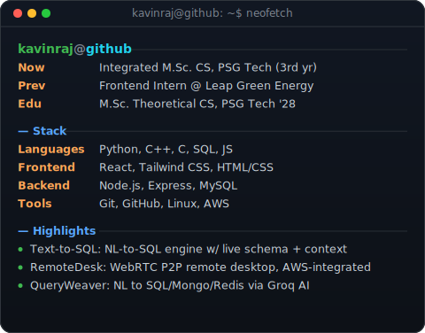

# Kavinraj S K
### Full-Stack Developer · AI-powered Dev Tools · CS Undergrad @ PSG Tech

<table>
<tr>
<td width="370" valign="top">

</td>
<td width="490" valign="top">

</td>
</tr>
</table>

Contribution graph refreshes daily via GitHub Actions.
